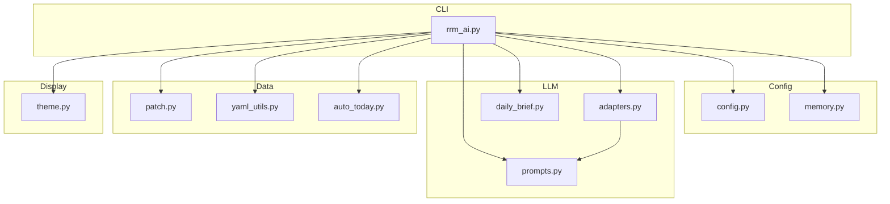
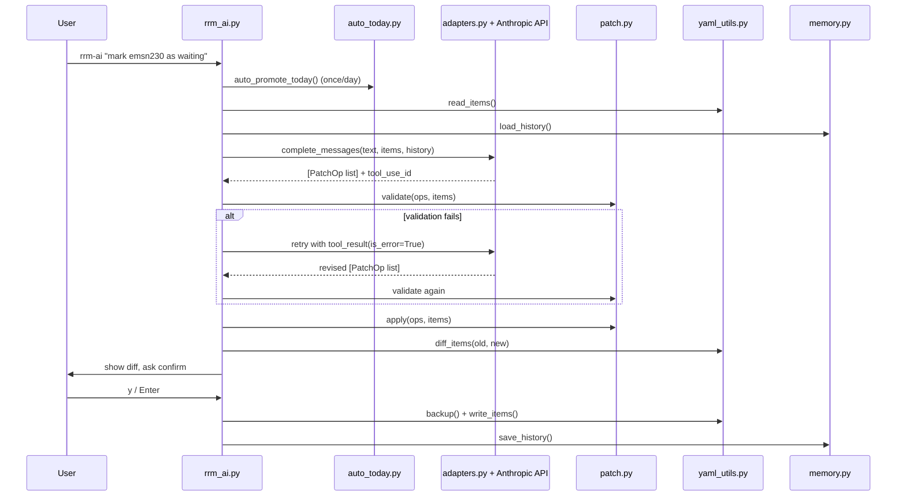

# Codebase Map

> Auto-generated by Cartographer. Last mapped: 2026-06-15T07:34:19Z

## System Overview

`rrm-ai` is a personal natural-language CLI for managing a YAML-based operational task list. The user types plain English; Claude interprets it into structured patch operations; Python validates and applies them to the YAML file. The LLM never edits the YAML directly.



## Directory Structure

```
rrm-ai/
├── rrm_ai.py          # CLI entry point and orchestration
├── adapters.py        # Anthropic API integration
├── prompts.py         # System prompt and user message construction
├── daily_brief.py     # No-arg daily brief prompt template
├── patch.py           # PatchOp dataclass, validate(), apply()
├── yaml_utils.py      # YAML I/O: read, write, backup, diff, archive
├── auto_today.py      # Auto-promote items to today based on due/recurs
├── config.py          # Config from env vars / .env file
├── memory.py          # Rolling 5-entry conversation history
├── theme.py           # Rich terminal color/style constants
├── tests/             # pytest test suite (~248 tests)
│   ├── conftest.py
│   ├── test_adapters.py
│   ├── test_auto_today.py
│   ├── test_config.py
│   ├── test_memory.py
│   ├── test_optional_fields.py
│   ├── test_patch.py
│   ├── test_prompts.py
│   ├── test_rrm_ai.py
│   ├── test_theme.py
│   └── test_yaml_utils.py
└── docs/
    └── CODEBASE_MAP.md
```

## Data Model (YAML Schema)

```yaml
- id: string          # required, stable lowercase identifier
  item: string        # required, human-readable title
  status: string      # required: in_progress | waiting | finished
  next_action: string # required, non-empty
  today: bool         # optional; max 3 items true at once
  due: string         # optional, YYYY-MM-DD
  recurs: string      # optional: weekly_fri | monthly_1 | monthly_last
```

**Invariants:**
- `finished` is permanent (no status reversal)
- `recurs` and `status=finished` are mutually exclusive
- At most `MAX_TODAY=3` items may have `today: true`
- IDs are stable; no deletion operation exists

## Module Guide

### `rrm_ai.py` — CLI Entry Point

**Purpose:** Top-level orchestration for all flows.  
**Entry point:** `main()` (registered as `rrm-ai` CLI command)  
**Key exports:** `main()`, `print_status()`

**Flows:**
- `--status`: read YAML + print sorted display, no LLM
- `--archive`: move finished items to `rrm-archive.yaml`
- `<text>`: NL → LLM → patch → validate → diff → confirm → write
- `--brief`: daily brief on `brief_model` (no history sent to LLM)

**Gotchas:**
- Confirmation accepts `""` (Enter) or `"y"` — anything else aborts
- LLM retry: if validation fails and `tool_use_id` exists, sends errors back as `tool_result` with `is_error: True` and calls LLM once more
- `print_status` sort order: `today=True` first → `in_progress` → `waiting` → rest (display only; YAML is never reordered)
- `auto_promote_today` runs on load once per calendar day (gated by state file)

---

### `adapters.py` — Anthropic API Integration

**Purpose:** Sends messages with the `apply_patch` tool and parses responses.  
**Key exports:** `AnthropicAdapter`, `get_adapter()`, `TOOL_SCHEMA`

**TOOL_SCHEMA:** Single tool `apply_patch` with input `{ operations: [...] }`. Each operation requires `op` (enum of 6 ops) and `id`. Other fields are op-dependent.

**`complete_messages()` returns:** `(result, raw_assistant_content, tool_use_id)` — caller uses raw content + tool_use_id to build a retry turn. `brief=True` switches to `config.brief_model` with `max_tokens=8000` (room for Sonnet 5's default thinking).

**Gotchas:**
- `max_tokens=1024` for non-brief calls — could limit large status files
- Mixed text+tool response: text preamble is silently discarded
- `get_adapter()` raises `ValueError` for any provider except `"anthropic"`

---

### `patch.py` — Validation and Application

**Purpose:** `PatchOp` dataclass and all validate/apply logic.  
**Key exports:** `PatchOp`, `validate()`, `apply()`, `VALID_STATUSES`, `VALID_RECURS`, `MAX_TODAY`

**The Six Operations:**

| Op | Required fields | Effect |
|---|---|---|
| `set_status` | `id`, `value` (in_progress/waiting/finished) | Updates status |
| `set_today` | `id`, `value` (bool) | Sets or removes `today` key |
| `set_next_action` | `id`, `value` (non-empty string) | Updates next_action |
| `set_due` | `id`, `value` (YYYY-MM-DD or null) | Sets or removes `due` key |
| `set_recurs` | `id`, `value` (weekly_fri/monthly_1/monthly_last or null) | Sets or removes `recurs` key |
| `add_item` | `id` (new), `item`, `status`, `next_action`; optional `today`, `due`, `recurs` | Appends new item |

**`validate()` behavior:**
- Returns all errors at once (not fail-fast)
- Tracks `today_changes`, `effective_recurs`, `effective_status` per id for cross-batch invariant checking
- A single batch can atomically clear `recurs` and set `finished`

**`apply()` behavior:**
- Deep-copies items — original is never mutated
- `set_today false` → removes the `today` key entirely
- `set_due null` / `set_recurs null` → removes the key entirely

---

### `yaml_utils.py` — YAML I/O

**Purpose:** All YAML reading, writing, backup, diff, and archive operations.  
**Key exports:** `read_items()`, `write_items()`, `backup()`, `diff_items()`, `archive_finished()`

**`write_items()`:** Serializes via `ruamel.yaml`, then `_normalize_item_spacing()` enforces one blank line between top-level items, no blank lines within an item.

**`diff_items()`:** Compares by ID. Fields diffed: `status`, `today`, `due`, `recurs`, `next_action`. Reports new IDs as additions and missing IDs as removals (removals only arise from `/undo`).

**Gotchas:**
- `preserve_quotes=True` — quoted strings in original YAML are re-quoted on write
- `backup()` always overwrites the `.bak` file unconditionally (not timestamped)

---

### `auto_today.py` — Auto-Promotion

**Purpose:** Promotes items to `today: true` based on `due` date or `recurs` schedule.  
**Key exports:** `auto_promote_today()`, `load_auto_today_date()`, `save_auto_today_date()`

**Recurs patterns:** `weekly_fri` (weekday==4), `monthly_1` (day==1), `monthly_last` (last day of month via `calendar.monthrange`)

**Gotchas:**
- State file guard lives in `rrm_ai.py`, not inside `auto_promote_today()` — function always promotes if called
- `due` comparison is a string comparison — handles ruamel.yaml returning `datetime.date` objects
- `_set_today_clean()` works around a ruamel.yaml formatting bug when appending the `today` key to a `CommentedMap`

---

### `prompts.py` — Prompt Construction

**Purpose:** Builds the system prompt and user message for LLM calls.  
**Key exports:** `build_system_prompt()`, `build_user_message()`

**System prompt key rules:** Two modes (QUERY vs MODIFICATION), max 3 `today:true`, `waiting` next_action must describe trigger action, `finished` is permanent.

**`build_user_message(text, items, history)`:** Serializes items to YAML, prepends numbered history, adds today's date, wraps YAML in a fenced code block.

**Gotchas:**
- History is labelled "for context only — do not repeat these actions"
- `history=None` and `history=[]` both produce no history section

---

### `config.py` — Configuration

**Purpose:** Loads config from environment variables (with `.env` file support).  
**Key exports:** `Config` (frozen dataclass), `load_config()`, `load_yaml_path()`

**`Config` fields:** `provider`, `model`, `api_key`, `yaml_path`, `brief_model`  
**Defaults:** `provider="anthropic"`, `model="claude-haiku-4-5"`, `brief_model="claude-sonnet-5"` (used for `/brief` and `--brief`)

**Gotchas:**
- `load_dotenv()` is called on every invocation — tests use `autouse` fixture to block real `.env` from bleeding in
- `load_yaml_path()` doesn't require `RRM_AI_API_KEY` — used by `--status` and `--archive`

---

### `memory.py` — Conversation History

**Purpose:** Persists a rolling window of 5 recent request/result pairs for LLM context.  
**Key exports:** `history_path()`, `load_history()`, `save_history()`, `format_patch_result()`, `MAX_ENTRIES`

**State file:** `rrm-history.json` (sibling of YAML file). Format: `[{"request": "...", "result": "..."}]`

**Gotchas:**
- `load_history()` silently returns `[]` on `JSONDecodeError` or `OSError`
- `format_patch_result()` intentionally omits values for `set_next_action` (brevity/privacy)
- History is NOT saved on dry-run or when user declines

---

### `daily_brief.py` — Daily Brief Prompt

**Purpose:** Generates the fixed prompt for `/brief` and `--brief`.  
**Key exports:** `build_daily_brief_prompt()`

**Behavior:** Returns a prescriptive prompt instructing the LLM to produce an "Operational Picture" with four sections (Today, In Progress, Waiting, Notes) in a fixed format. Waiting lines carry due/recurs tags. Notes is limited to facts: waiting items that are really the user's own work, items due within 7 days that are not in progress, and items blocking two or more others that are neither today nor in progress. Sent to `brief_model`; history is not passed in `--brief`.

---

### `theme.py` — Display Constants

**Purpose:** All terminal color/style constants for Rich output.  
**Key exports:** `THEME` (dict), `STATUS_STYLES` (dict), `LLM_MARKDOWN_THEME` (dict)

No logic — pure constants. `STATUS_STYLES` maps every `VALID_STATUSES` value to a Rich style.

---

## Data Flow



## Side-Effect Files

All sibling files of the primary YAML (set via `RRM_AI_YAML`):

| File | Purpose |
|---|---|
| `rrm-status.yaml` | Primary task data |
| `rrm-status.yaml.bak` | Overwritten backup before every write; `/undo` swaps it with the primary file |
| `rrm-archive.yaml` | Finished items accumulate here |
| `rrm-archive.yaml.bak` | Backup of archive before extension |
| `rrm-history.json` | Rolling 5-entry conversation history |
| `rrm-auto-today.txt` | Date of last auto-promote run (YYYY-MM-DD) |

## Conventions

- Module names match the concept they implement (no `utils.py` catch-all)
- `ruamel.yaml` used throughout for round-trip fidelity (preserves quotes, formatting)
- Validation is always exhaustive (returns all errors, not fail-fast)
- `apply()` always deep-copies — never mutates input
- Optional fields that are cleared are deleted from the dict (not set to `null`/`False`)
- `uv run pytest` for all tests; `uv tool install --reinstall --editable .` to reinstall CLI

## Gotchas

- Every new module must be added to `py-modules` in `pyproject.toml` before reinstalling
- `requirements.txt` is stale — does not include `rich`; `pyproject.toml` is authoritative
- `max_tokens=1024` for non-brief calls in `adapters.py` could become a limit for very large status files
- The ruamel.yaml blank-line bug in `auto_today.py:_set_today_clean()` is the most complex workaround in the codebase
- `/undo` only swaps `rrm-status.yaml` with its `.bak`; undoing `/archive` leaves the moved items in `rrm-archive.yaml` too

## Navigation Guide

**To add a new operation:** `patch.py` (add op to `VALID_OPS`, add validation branch, add apply branch) → `adapters.py` (update `TOOL_SCHEMA`) → add tests in `test_patch.py`, `test_optional_fields.py`

**To change LLM behavior:** `prompts.py` (`SYSTEM_PROMPT` or `build_user_message`)

**To change display/colors:** `theme.py`

**To change auto-promotion logic:** `auto_today.py` (`_recurs_fires_today` or `auto_promote_today`)

**To change confirmation/retry flow:** `rrm_ai.py` (`main`)

**To change YAML formatting:** `yaml_utils.py` (`_normalize_item_spacing`, `_make_yaml`)
